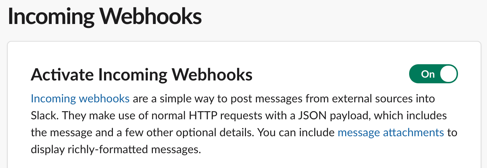
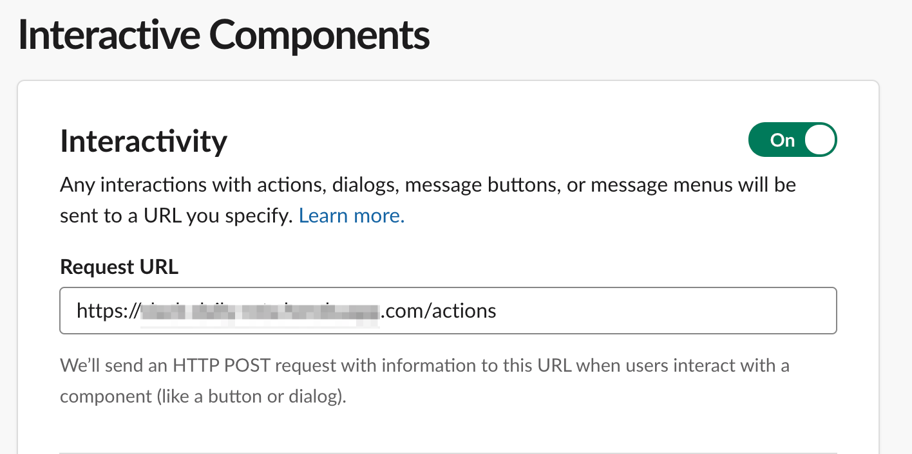
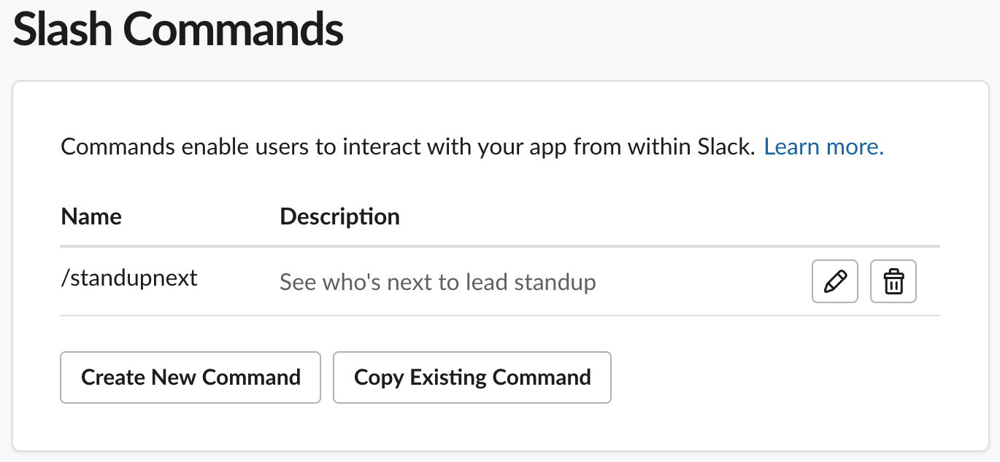

# Daily Rota

A Slack app to inform a channel which team member is next up.

## Why was this made?
Our team rotates daily standup running amongst team members. We sometimes forget who's up next until a few moments before the meeting which means it starts late (espcially as the meeting caters for remote workers, so we need to setup equipment to dial them in).

## Is it just for standup meetings?
That was the original idea, but there's no reason it can't be adapted for other activities like:
* Support/on-call rotas
* Boring task schedules
* "Who's turn is it to make the teas?"
* "Your mama" jokes
* And so on ...

## Features
* Sends a message to Slack (via incoming webhooks) following the order of team members specified
* @ mentions the user so they are notified
* Configurable random message combinations
* Ability to exclude certain days (Weekends or public holidays)
* Browser interface to see status, advance/skip members or go back (coming soon)

## Basic requirements to make it work
1. Slack instance with permissions to add an app to a channel
1. Node.js v10.16+ environment to run this app
1. Postgres database to persist data (probably overkill, but it's what it is for now)
1. A scheduler i.e. ability to trigger the send message action periodically. The app can't do this on it's own yet so my team uses [Heroku Scheduler](https://elements.heroku.com/addons/scheduler) in our own case.

## Development

### Running it locally

```npm run start```

You'll need to have your database and Slack crednetials in place first before you start. You should also duplicate and rename `sample.env` to `.env` and populate the file with all the necessary configuration details.

### Database

The app is dependent on storing data in a postgresql database. It uses a single row entry to read/update data, ensuring the data footprint is very small. The data is in the following format:


You can specifying the location of the postgres database server in your environment variables (or `.env` file). The entry should look like below:
```
DATABASE_URL=postgresql://username@localhost:5432/dbname
```
ℹ️If you're hosting on Heroku, it automatically manages your db host and credentials so you don't need to configure it as stated above. [Learn more](https://www.heroku.com/postgres)

Whether you are running the app locally or in production, you need to setup the data correctly. Below are steps to creating valid tables to kickstart your app.
### Create table

```sql
CREATE TABLE rota_data (
   row_id integer,
   row_data VARCHAR (50) NOT NULL
);
```

### Add initial data to table

```sql
INSERT INTO rota_data(row_id, row_data)
VALUES
   (1, '{"rotaIndex":6,"date":"Mon Aug 12 2019"}');
```
`row_data` is the key field here as this is where the position in the rota is stored. The app simply works by reading the `rotaIndex` value from the JSON blob and finding who has that position in the rota.

## Slack Configuration

Another essential part of the app is configuring Slack correctly. There are 3 main aspects to have to enable for your Slack channel:

* Incoming Webhooks
* Interactive components
* Slash commands

### Incoming Webhooks

Incoming webhooks allows the app to post messages from your Node server. Ensure they are enabled in your [app config](https://api.slack.com/apps/).



## Interactive components



## Slash commands



ℹ️ If you're running/testing the app locally, you may need to proxy your localhost to a publicly available endpoint for use in Slack. [Ngrok](https://api.slack.com/tutorials/tunneling-with-ngrok) seems to be the go-to tool for doing this.